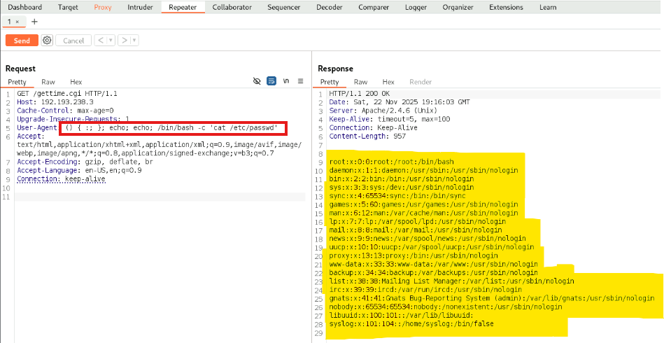

# Metasploit

## 🧰 Présentation rapide

Metasploit Framework est un outil de pentest (test d’intrusion) open source, utilisé pour :
* Scanner des failles de sécurité,
* Exploiter des vulnérabilités connues,
* Lancer des payloads,
* Créer et tester des exploits personnalisés.
Il est inclus par défaut dans Kali Linux.

---

## ⚙️ Démarrage  
📌 **Vérifier que Metasploit est bien installé :**
```bash
msfconsole --version
```
S'il n'est pas installé, l'installer depuis les dépôts officiels :  
```bash
sudo apt update
sudo apt install metasploit-framework -y
```

📌 **Démarrage de "postgresql"**  
`systemctl enable postegresql` ou `service postgresql start`  

  
📌 **Lancer metasploit**  
``msfconsole``  

📌 **Vérifier le statut de la base**  
```bash
db_status
``` 
doit renvoyer `Connected to msf. Connection type: postgresql` pour vérifier que la base de données est bien connectée.  

---

## 🧭 Commandes de base à connaître
| Commande                  | Description                                     |
| ------------------------- | ----------------------------------------------- |
| ``help``                  | Affiche l’aide                                  |
| ``search nom_du_module``  | Cherche un exploit, un payload ou un auxiliaire |
| ``use chemin/du/module``  | Charge un module                                |
| ``show options``          | Affiche les paramètres nécessaires              |
| ``set PARAM valeur``      | Définit un paramètre                            |
| ``run ou exploit``        | Lance le module                                 |
| ``workspace -a <MyWork>`` | Permet de créer un nouvel espace de travail     |


``db_import /root/myXMLdoc``  

---

**Créer un espace de travail**  
```bash
workspace -a "My_Workspace"  
``` 

**Vérifier sur quel espace de travail nous sommes**  
```bash
workspace  
``` 

**Recherche de modules auxiliaires**  
Exemple :
```bash
search portscan 
``` 
➡️ Va rechercher tous les chemins contenant le nom "portscan"

Pour une recherche affinée parmi une grande liste :
```bash
search type:auxiliary name:smb
```
➡️ Va filtrer en recherchant dans les dossiers "auxiliary", et le nom "smb"


**Choisir son module**
```bash
use auxiliary/path/to/research 
```
ou
```bash
use 4
```
➡️ Ici "4" est le chiffre raccourci du nom du module (auxiliaire)  



**Afficher options du module choisi et les modifier**  
```bash
show options
```
Il suffit de choisir l'option qui nous intéresse pour lui attribuer une nouvelle valeur, exemple :
```bash
set RHOSTS 192.86.140.3
```
➡️ va cibler la machine à l'adresse IP indiquée.

**Lancer le module (auxiliaire)**
```bash
run
```
ou
```bash
exploit
```


**Meterpreter**
Meterpreter (interpréteur) se lance sur la cible une fois que l'on est connecté dessus et donc que l'execution du module a réussi.


## Importer scan Nmap dans MSF

Après enregistrement de la sortie de la commande Nmap en format xml (-oX), nous allons importer le scan dans la console MSF.  
